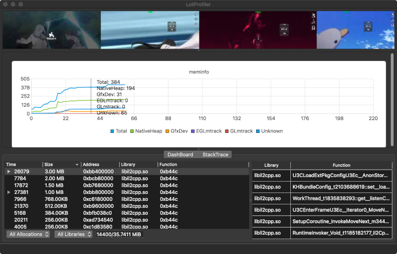

# Loli Profiler

轻量开源内存分析工具（Lightweight Opensource profiLing Instrument）



**注意：此程序仍处于初级研发阶段**

## 特性

- 可以Profile所有Debuggable的程序（Root后的设备可Profile所有程序）
- 可hook目标APK中任意so库
- 可将函数地址自动批量转换为函数名称
- 自动分析数据展示常驻内存
- 每5s自动截图一次
- 从手机端实时获取内存相关函数的堆栈信息（通过TCP Socket）
- 网络包使用LZ4压缩以加快收发速度
- 运行流畅（使用C++与QT开发）
- 同时支持Windows 10与Mac OSX（Mojave+）操作系统

## 简介

首先在移动设备上安装debuggable的apk程序，打开LoliProfiler，首先选择Python的路径，接着输入apk程序名称如：com.company.name，最后点击Launch即可。采集一段时间数据后，点击Stop Capture，即可完成采集。完成采集后LoliProfiler会分析获取的数据，并将采集结束前未释放的内存数据展示在StackTrace页签中。一般情况下堆栈数据会包含函数地址信息，你需要提供安卓NDK工具链中的addr2line可执行程序的路径给LoliProfiler。接着就可以选择Load Symbol来加载符号表数据，当翻译完成后，StackTrace中的数据就会被翻译为真正的函数名称。


对于Unity于UE4，可使用如下选项让引擎使用malloc进行内存分配，便于定位真正的问题

### Unity

```java
protected String updateUnityCommandLineArguments(String cmdLine) {
    return "-systemallocator";
}
```

### UE4

```c++
FMalloc* FAndroidPlatformMemory::BaseAllocator() {
#if USE_MALLOC
    return new FMallocAnsi();
#else
    return new FMallocBinned(MemoryConstants.PageSize, MemoryLimit);
#endif
}
```

## 计划

**短期计划**

* hook 更多的内存相关函数 realloc/etc ... 
* 尝试同时支持 PLT hook 与 Inline hook
* 计划中 ... 

## 编译

**环境**

* QT 5 或更高
* 安装QtCharts插件
* QT Creater 4.8 或更高
* C++11 编译器
* Android NDK r16b 或更高

## 链接

* FAQ https://git.code.oa.com/xinhou/loli_profiler/wikis/faq
* KM介绍文章 http://km.oa.com/articles/show/408991
* xHook https://github.com/iqiyi/xHook
* 图标 https://www.flaticon.com/authors/smashicons
* 定期预编译的程序 https://git.code.oa.com/xinhou/loli_profiler/wikis/home
