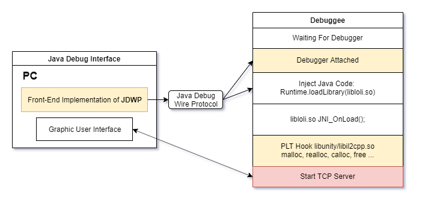

[TOC]

# Efficient Native Memory Profiling Solution For Android

## Brief

We couldn't find a easy to use native memory profiling tool on Android platform for a long time. This project is meant to provide a new way to easily profile native memory on Android. By using some mature technologies we achieved a highly efficient solution.

## How does it work

### Data Gathering

By using JDWP (Java Debug Wire  Protocol) protocols, we can inject Java code to running Android applications. In this way we're able to inject library loading code to load any native Android libraries. We use PLT Hook technology to hook memory allocation function like malloc/realloc/etc, so we can record the allocation process however we like. After gathered necessary data, we send them trough TCP Socket using ADB (Android Debug  Bridge) port forwarding. So we can further analysis these data off-line on our PC. 

### Performance optimization

By doing some performance related analysis, we figured that the stack unwinding process is the biggest performance bottleneck, so we tested some mature stack unwinding solutions: 

| Stack Unwinder        | Pros        | Cons                    |
| --------------------- | ----------- | ----------------------- |
| libunwind.so          | Plug & Play | Slow                    |
| instrument-functions  | Fast        | Re-compile & Bigger APK |
| no-omit-frame-pointer | Fastest     | Re-compile              |

The first one is using Android's libunwind library to unwind the call stack. We can use it out of the box. It's efficient enough for small projects. And we use the same trick found in Google's perfetto tool to optimize it's overall performance. But it's still not fast enough for real projects.

The second one is found in GaoDe Maps' tech [blog](https://developer.aliyun.com/article/708672). They use compiler option to instrument function calls to all functions found in your APK. This way they can implement a custom stack unwinder. It's way faster than the default one. It's 10 times faster in single thread tests, and 50 times faster in multi thread use cases. The biggest pitfall is that the compiler option will lead to a much bigger APK file size. Especially for large projects. 

The third one is found in Google's Address Sanitizer project. By using compiler options, we can store stack function pointer in a register, which is very efficient compared to the other two. It's by far the fastest solution. And it won't affect APK's file size. It's the one you should use when your compiler supports this feature.  

|                         | Time     | APK    | libUE4.so |
| ----------------------- | -------- | ------ | --------- |
| baseline                | 00:14.34 | 217MiB | 1.68G     |
| framepointer            | 00:14.34 | 217MiB | 1.68G     |
| instruemnt after-inline | 00:18.38 | 226MiB | 1.72G     |
| instruemnt              | 00:49.88 | 330MiB | 2.45G     |
| basic method            | 08:05.41 | 217MiB | 1.68G     |

*Unreal Engine 4 Demo performance data by using these solutions.*

*Measures the time between opening the APK and after entering the game scene.*

### Performance Data

Tested with a complex UE4 game using snapdragon 865 Mobile phone.

Packaged in Test build. Sampled for 122s. The average FPS drops from 57 to 26, still playable.

Game thread has 1.65x overhead on average. 2.2x on render thread.

**We recommend using a snapdragon 855 CPU or a better one to profile big & complex project.**

By using compiler option -fno-omit-frame-pointer, we store framepointer in a register. Then we can use __builtin_frame_address(0) to get it's address and to finally gather the stack frame information.

### Storage Optimization

Complex (Game) projects will frequently allocate memories. We gathered 10 million records in 480 seconds in our game, it's 25 thousand records per second. It quickly becomes a bottleneck to computer's memory. So we did some optimizations to lower it's damage.

First, we use more compact format to store records. Next we implemented streaming solutions by constantly dumping memory to hard drive to lower the memory consumption. After profiling is finished. We then load the cached memory one by one to keep memory consumption low. And we only store persistent records in memory. 

With all these tricks together, we achieved a complete solution which is able to support profiling complex game projects.

